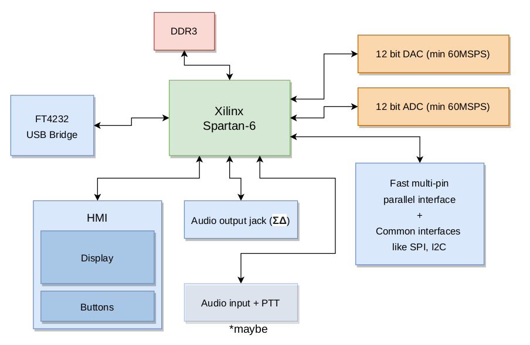

# SiNGTool
It's simple signal analyzer/generator.  
Can be used also as portable radio receiver and transmitter - SDR.

## What i have done so far
1. Conceptional works - just made a block diagram with components of project

## But how does it work?
SiNGTool can work both with PC or standalone using embedded display.

It can pipe RF samples from ADC to PC, or from PC to DAC,  
using a high-speed FT4232HL usb bridge interface.

There is a portable mode, where You can watch waveforms/spectrums  
on the display, and generate Your own on the go!  
All You need will be headphones,and microphone with PTT button.

FPGA can be configurated also over FT4232HL  
by bitbanging the configuration pins.

## But why?

Because everyone should be able to transmit and receive whatever he wants  
(on unlicensed spectrums, in EMC chamber or using 50ohm termination instead of antenna of course).

Please obey local radio regulations. Use filters when transmitting.  
Beware of harmonics. If You really like radiocommunication, get ham radio license.
