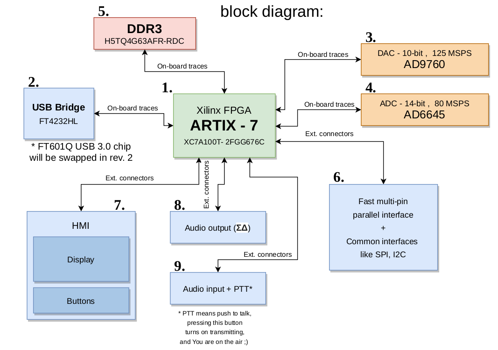

# SiNGTool
It's simple signal analyzer/generator.  
Can be used also as portable radio receiver and transmitter - SDR.

## What i have done so far
1. Conceptional works - just made a block diagram with components of project
2. ~~Swapped FT4232 to FT601Q - to make PC - FPGA interface FASTER!~~(FT601Q needs more testing, will be used in SiNGTool v2)
3. Swapped Xilinx Spartan-6 with ARTIX-7 - more processing resources! 

## But how does it work?
SiNGTool can work both with PC or standalone using embedded display.

It can pipe RF samples from ADC to PC, or from PC to DAC,  
using a USB  bridge interface.

There is a portable mode, where You can watch waveforms/spectrums  
on the display, and generate Your own on the go!  
All You need will be headphones, and microphone with PTT button.

Powerful Xilinx FPGA ARTIX-7 offers a lot of space for IP cores - ideal tool  
for experiments with digital signal processing.

FPGA can be configurated also over USB Bridge  
by bitbanging the configuration pins.  
That's why Xilinx Platform Cable will be not neccasary to program FPGA.  

## But why?

Because everyone should be able to transmit and receive whatever he wants  
(on unlicensed spectrums, in EMC chamber or using 50ohm termination instead of antenna of course).

### Disclaimer
Please obey local radio regulations. Use filters when transmitting.  
Beware of harmonics. If You really like radiocommunication, get ham radio license.
